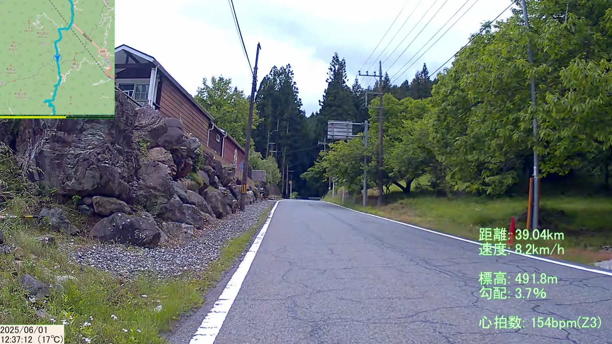

# VSD for Bicycle

[VSD for GPS](https://github.com/yoshinrt/vsd)とaviutlを利用してサイコンのGPSログ(.fit)を動画にする

**既知の問題
- 使用手順が自分用にしかなっていない
- (GPSの測位ができていない等で)距離・位置情報が変化しない区間があると勾配がありえない数字になる
  - 前方の情報しか計算に入れていないせい
